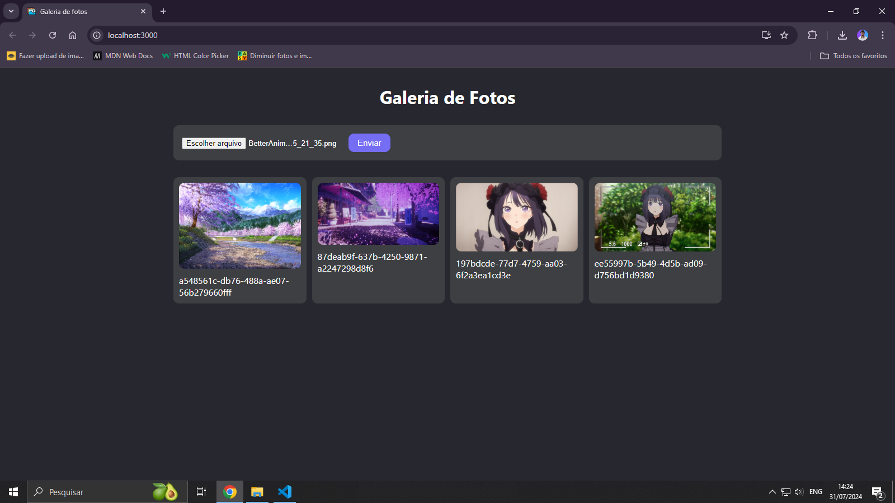
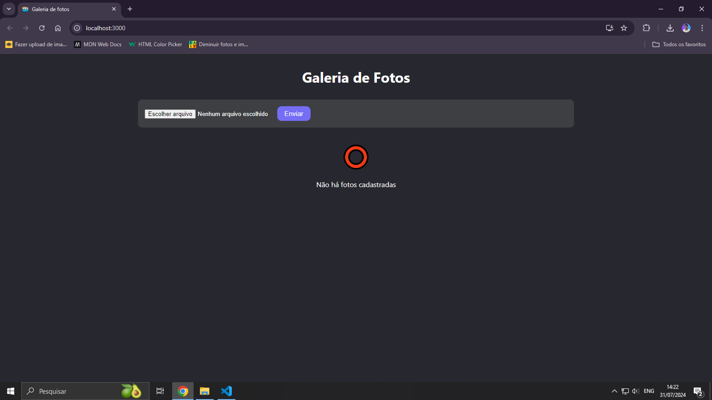
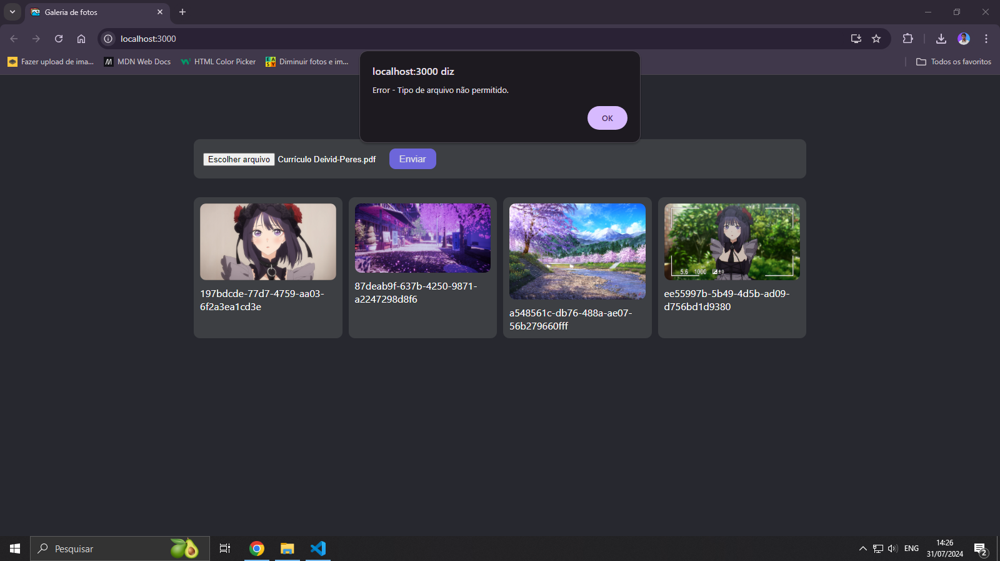

# 📸 Galeria de Fotos

Bem-vindo ao projeto **Galeria de fotos com React e Typescript**! Este é um projeto de galeria de fotos desenvolvido com ReactJS, TypeScript e Firebase. Os usuários podem enviar suas fotos preferidas, que serão armazenadas e exibidas. O armazenamento é feito usando o Google Firebase Storage. O projeto também utiliza Styled Components para estilização.

## 🚀 Funcionalidades

- Envio de fotos pelos usuários.
- Exibição das fotos enviadas na galeria.
- Tratamento de erros para formatos de arquivo inválidos.

## 🛠️ Tecnologias Utilizadas

- **ReactJS** - Biblioteca JavaScript para construção de interfaces de usuário.
- **TypeScript** - Superset do JavaScript que adiciona tipos estáticos.
- **Firebase** - Plataforma de desenvolvimento de apps da Google.
  - **Firebase Storage** - Armazenamento de arquivos.
- **Styled Components** - Biblioteca para estilização de componentes em React.

## 📷 Screenshots

### Galeria com Imagens

### Tela Inicial (sem uploads)

### Tratamento de Erro (Arquivo Inválido)

Feito com 💖

### 🇺🇸 English description

# 📸 Photo Gallery

Welcome to the **Photo Gallery with React and TypeScript** project! This is a photo gallery project developed with ReactJS, TypeScript, and Firebase. Users can upload their favorite photos, which will be stored and displayed. The storage is handled using Google Firebase Storage. The project also utilizes Styled Components for styling.

## 🚀 Features

- Users can upload photos.
- Display of uploaded photos in the gallery.
- Error handling for invalid file formats.

## 🛠️ Technologies Used

- **ReactJS** - JavaScript library for building user interfaces.
- **TypeScript** - Superset of JavaScript that adds static types.
- **Firebase** - Google's app development platform.
  - **Firebase Storage** - File storage.
- **Styled Components** - Library for styling React components.

## 📷 Screenshots

### Gallery with Images

### Initial Screen (no uploads)

### Error Handling (Invalid File)

Made with 💖